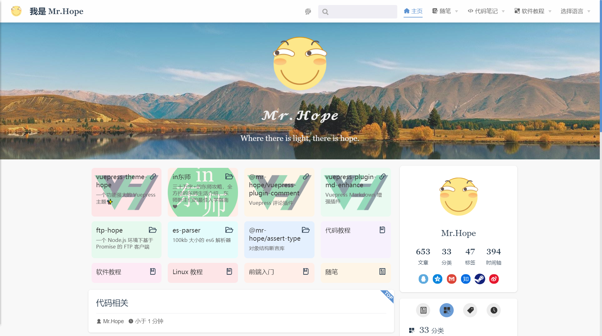

# Blog homepage

vuepress-theme-hope allows you to enable a blog-style homepage.

You need to set `blog` to `true` in the Front Matter of the corresponding page to enable blog style.

## Configurable items

You can freely configure the blogger's avatar and blogger's name display in the left-top corner. Their configuration items are `themeConfig.blog.avatar` and `themeConfig.blog.name`. If you do not fill them in, they will automatically fall back to the site Logo (`themeConfig.logo`) and the site name (`themeConfig.name`).

If you use `themeConfig.intro` to configure the address of the personal introduction page, click on the blogger ’s profile picture and blogger ’s name in the left-top corner, and it will automatically jump to the link you provided.

You can also configure your social media links in the format of `<social media name>: <social media links>` in the object `themeConfig.blog.links`.

::: tip Available social media:

- `'Baidu'`
- `'Bitbucket'`
- `'Dingding'`
- `'Discord'`
- `'Dribbble'`
- `'Evernote'`
- `'Facebook'`
- `'Flipboard'`
- `'Gitee'`
- `'Github'`
- `'Gitlab'`
- `'Gmail'`
- `'Instagram'`
- `'Line'`
- `'Linkedin'`
- `'Pinterest'`
- `'Pocket'`
- `'QQ'`
- `'Qzone'`
- `'Reddit'`
- `'Rss'`
- `'Steam'`
- `'Twitter'`
- `'Wechat'`
- `'Weibo'`
- `'Whatsapp'`
- `'Youtube'`
- `'Zhihu'`

:::

If you are not satisfied with the prompt text on the top of the timeline page, you can use `themeConfig.blog.timeline` to customize one.

## available parameters in Front Matter

### hero

- Type: `boolean`
- Default: `true`

Whether to display the icon and description of the home page. For the icons and description settings of the homepage, please see the default homepage.

### bgImage

- Type: `string`

For the address of the background picture, you must fill in the absolute path. If not filled in, a default landscape picture will be automatically applied.

### bgImageStyle

- Type: `Record <string, string>`

The CSS style of the background image.

### heroImageStyle

- Type: `Record <string, string>`

CSS style for home icon

### Projects

- Type: `ProjectOption[]`

`ProjectOption` including this keys:

- `type`: type of the project, you can choose from `'link' | 'project' | 'book' | 'article'`
- `name`: required, project name
- `link`: required, project link, fill in an external path or absolute path
- `desc`: project description
- `cover`: project cover, fill in an external path or absolute path
